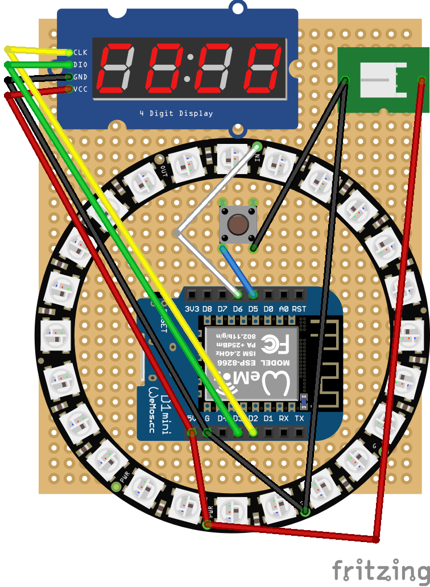
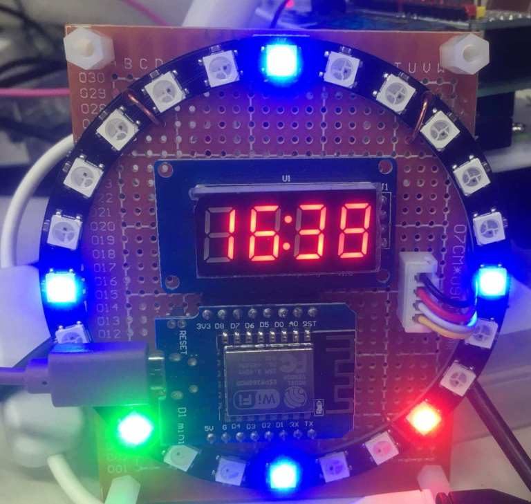

# Esp8266 NeoPixel clock
This project uses the Adafruit NeoPixel library to control a 60 LED NeoPixel ring as a clock. 

Hardware required

* 1 x Neo Pixel Rings (24 LED's)
* 1 x TM1637Display
* 1 x ESP8266 module. I am using the WeMos D1 mini
* 1 x button
* some dupont cables. 

Display
* Hour Red
* Min. Green
* Sec. White

4 blue light on 3, 6, 9, 12 Clock posision

